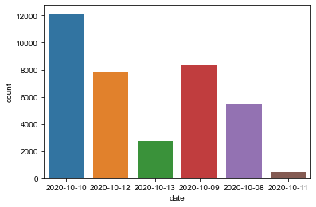
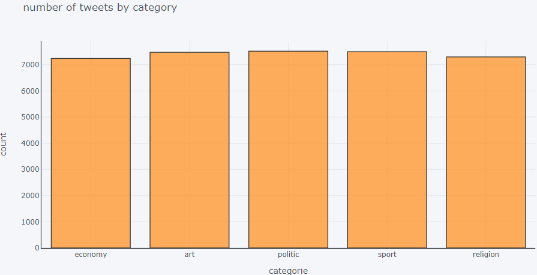

<h1>the goal of this project is to extract arabic tweets data with twitter streaming api and then create machine learning models that allow a text to be classified into  sport, religion, economy, art, politic categories </h1>

<h2>twitter data is extracted between 2020/10/08 and 2020/10/13</h2>

<h2>number of tweets by category </h2>

<ul> <h1>Project Steps:</h1>
  <li>Preprocessing</li>
  <li>Nltk</li>
  <li>Word Frequencies</li>
  <li>Unigram,bigrams,trigrams by Counts </li>
  <li>Arabic Stop-words</li>
  <li>Tokenize Word and Sentence</li>
  <li>Arabic Stemmer</li>
  <li>Bag of word</li>
  <li>Tf Idf</li>
  <li>Arabic Word Cloud</li>
  <li>SVM</li>
  <li>Naive Bayes</li>
  <li>LSTM</li>
  </ul>
